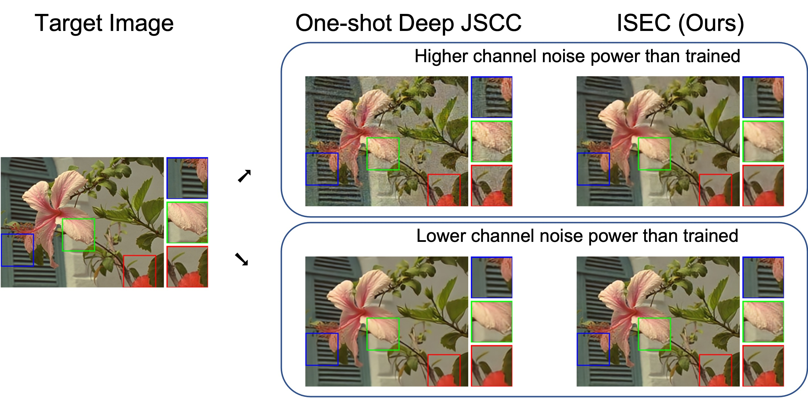

# Deep Joint Source-Channel Coding with Iterative Source Error Correction

An official Pytorch implementation of [Deep Joint Source-Channel Coding with Iterative Source Error Correction (AISTATS23)](https://arxiv.org/abs/2302.09174) 

## Summary

 

Deep joint source-channel coding (Deep JSCC) transmits a source through a noisy channel using deep neural network encoders and decoders. In our [AISTATS paper](https://arxiv.org/abs/2302.09174), we introduce an *iterative source error correction (ISEC)* algorithm which corrects the source error in the *codeword (latent) space* of the Deep JSCC encoder and decoder.
This is achieved by maximizing the *modified maximum a posteriori (MAP)* probability, which comprises both the likelihood and the prior probability, using gradient ascent. 
While obtaining the likelihood is simple, estimating the prior probability of the codeword space of Deep JSCC is highly challenging. 
To address this, we use a *bias-free CNN denoiser* to predict the gradient of the log prior probability. 
Empirical evidence indicates that the decoded results from ISEC contain less distortion and more details than those from the one-shot decoding, especially when training and testing environments of the channel are mismatched.

## Getting Started

### Dependencies

Python3.8+, Pytorch 1.9+, matplotlib, tensorboard, argparse, [pytorch-msssim](https://github.com/VainF/pytorch-msssim), [lpips](https://github.com/richzhang/PerceptualSimilarity), [pytorch-fid](https://github.com/mseitzer/pytorch-fid)


## Data Preparation

### Kodak image

Kodak images can be downloaded from [http://r0k.us/graphics/kodak/](http://r0k.us/graphics/kodak/)

### Openimages

1. Install [awscli](https://aws.amazon.com/cli/)
2. Download the first two training data file and the validation set.

```bash
aws s3 --no-sign-request cp s3://open-images-dataset/tar/train_0.tar.gz [target_dir/train]
aws s3 --no-sign-request cp s3://open-images-dataset/tar/train_1.tar.gz [target_dir/train]
aws s3 --no-sign-request sync s3://open-images-dataset/validation [target_dir/val]
```

3. Unzip the files

```bash
tar -xzf [target_dir/train]/train_0.tar.gz -C PATH_TO_DATA_DIR/train/
tar -xzf [target_dir/train]/train_1.tar.gz -C PATH_TO_DATA_DIR/train/
tar -xzf [target_dir/val]/validation.tar.gz -C PATH_TO_DATA_DIR/val/
```

### CIFAR-10

CIFAR-10 images will be automatically downloaded if needed.


## Pretrained Models

Pretrained models on CIFAR-10 and Openimages are available 
[here](https://drive.google.com/drive/folders/1nFAosEok5TBPY8DjudHLvs79WUCLzYiQ?usp=sharing).

#### List of available models 

* Channel-per-pixel (CPP) = `0.5 * len(codeword) / len(input_image)`.
  
| Dataset    | Channel-per-pixel (CPP) [`-nc` option] | Signal-to-noise ratio (SNR) |
|------------|---------------------------------|-----------------------------|
| CIFAR-10   | 1/6 [`-nc=16`], 1/12 [`-nc=8`]  | 0, 5, 10                    |
| Openimages | 1/6 [`-nc=16`], 1/16 [`-nc=6`]  | 1, 7, 13                    |


## Evaluation


### CIFAR-10

```bash
# trained SNR=5dB, test SNR=0,5,10dB, CPP=1/6
python eval.py -s 0 -st 5 -lr 0.002 --alpha=1.0 --delta=1.0 -jmp "saved_models/cifar/cpp_1_6/snr_5/cifar_16.pb" -bmp "saved_models/cifar/cpp_1_6/snr_5/cifar_16_bfcnn.pb" -nc 16 --print_freq=10 -bs 256 --num_conv_blocks=2 --num_residual_blocks=2 -dset "cifar" -ni 50 -mb 100 -ne 1 --gpu=0 --save_images
python eval.py -s 5 -st 5 -lr 0.002 --alpha=1.0 --delta=1.0 -jmp "saved_models/cifar/cpp_1_6/snr_5/cifar_16.pb" -bmp "saved_models/cifar/cpp_1_6/snr_5/cifar_16_bfcnn.pb" -nc 16 --print_freq=10 -bs 256 --num_conv_blocks=2 --num_residual_blocks=2 -dset "cifar" -ni 50 -mb 100 -ne 1 --gpu=0 --save_images
python eval.py -s 10 -st 5 -lr 0.002 --alpha=1.0 --delta=1.0 -jmp "saved_models/cifar/cpp_1_6/snr_5/cifar_16.pb" -bmp "saved_models/cifar/cpp_1_6/snr_5/cifar_16_bfcnn.pb" -nc 16 --print_freq=10 -bs 256 --num_conv_blocks=2 --num_residual_blocks=2 -dset "cifar" -ni 50 -mb 100 -ne 1 --gpu=0 --save_images
```

### Kodak

```bash
# trained SNR=7dB, test SNR=1,7,13dB, CPP=1/6
python eval.py -s 1 -st 7 -lr 0.001 --alpha=4.0 --delta=1.0 -jmp "saved_models/openimages/cpp_1_6/snr_7/openimages_16.pb" -bmp "saved_models/openimages/cpp_1_6/snr_7/openimages_16_bfcnn.pb" -nc 16 --print_freq=10 -bs 1 --num_conv_blocks=2 --num_residual_blocks=3 -dset "kodak" --data_dir="./data/kodak" --num_hidden=128 -ni 50 -mb 100 -ne 10 --gpu=0 --save_images
python eval.py -s 7 -st 7 -lr 0.001 --alpha=4.0 --delta=1.0 -jmp "saved_models/openimages/cpp_1_6/snr_7/openimages_16.pb" -bmp "saved_models/openimages/cpp_1_6/snr_7/openimages_16_bfcnn.pb" -nc 16 --print_freq=10 -bs 1 --num_conv_blocks=2 --num_residual_blocks=3 -dset "kodak" --data_dir="./data/kodak" --num_hidden=128 -ni 50 -mb 100 -ne 10 --gpu=0 --save_images
python eval.py -s 13 -st 7 -lr 0.001 --alpha=4.0 --delta=1.0 -jmp "saved_models/openimages/cpp_1_6/snr_7/openimages_16.pb" -bmp "saved_models/openimages/cpp_1_6/snr_7/openimages_16_bfcnn.pb" -nc 16 --print_freq=10 -bs 1 --num_conv_blocks=2 --num_residual_blocks=3 -dset "kodak" --data_dir="./data/kodak" --num_hidden=128 -ni 50 -mb 100 -ne 10 --gpu=0 --save_images
```

### Kodak-with additive white Laplace noise

```bash
python eval.py -dist "Laplace" -s 7 -st 7 -lr 0.001 --alpha=4.0 --delta=1.0 -jmp "saved_models/openimages/cpp_1_6/snr_7/openimages_16.pb" -bmp "saved_models/openimages/cpp_1_6/snr_7/openimages_16_bfcnn.pb" -nc 16 --print_freq=10 -bs 1 --num_conv_blocks=2 --num_residual_blocks=3 -dset "kodak" --data_dir="./data/kodak" --num_hidden=128 -ni 50 -mb 100 -ne 10 --gpu=0
```


## Training

### Deep JSCC Models on CIFAR-10

```bash
# SNR=5, CPP=1/6
python train_deep_jscc.py --gpu=0 --model_path=PATH_TO_MODEL_DIR -nc 16 -e 300 -bs 64 -lr 2e-4 --num_conv_blocks=2 --num_residual_blocks=2 --snr 5 --print_freq=100 -dset "cifar"
```

### Bias-free Codeword Denoisers on CIFAR-10

```bash
# SNR=5, CPP=1/6
python train_bf_cnn.py --gpu=0 --model_path=PATH_TO_MODEL_DIR -nc 16 -e 300 -bs 64 -lr 2e-4 --num_conv_blocks=2 --num_residual_blocks=2 --snr=5 --print_freq=100 -dset "cifar" --pretrained_model_path="./saved_models/cifar/cpp_1_6/snr_5/cifar_16.pb"
```


### Deep JSCC Models on OpenImages

```bash
# SNR=7, CPP=1/16
python train_deep_jscc.py --gpu=0 --model_path=PATH_TO_MODEL_DIR  --data_dir=PATH_TO_DATA_DIR -nc 6 -e 45 -bs 128 -lr 1e-3 --num_conv_blocks=2 --num_residual_blocks=3 --snr 7 --print_freq=100 -dset "openimages" --image_size=128 --display_freq=1 --num_hidden=128 --save_freq=6 --test_freq=3
```


### Bias-free Codeword Denoisers on OpenImages

```bash
# SNR=7, CPP=1/16
python train_bf_cnn.py --gpu=0 --model_path=PATH_TO_MODEL_DIR  --data_dir=PATH_TO_DATA_DIR -nc 6 -e 25 -bs 64 -lr 2e-4 --num_conv_blocks=2 --num_residual_blocks=3 --snr 7 --print_freq=100 -dset "openimages" --image_size=128 --display_freq=1 --num_hidden=128 --save_freq=6 --test_freq=3 --pretrained_model_path="./saved_models/openimages/cpp_1_16/snr_7/openimages_6.pb"
```

## Citation

If you use this code or find our work valuable, please cite:
```
@inproceedings{lee2023deep,
    title={Deep Joint Source-Channel Coding with Iterative Source Error Correction},
    author={Lee, Changwoo and Hu, Xiao and Kim, Hun-Seok},
    booktitle={International Conference on Artificial Intelligence and Statistics},
    year={2023}
}
```


## License

This project is licensed under the MIT License - see the LICENSE.md file for details

